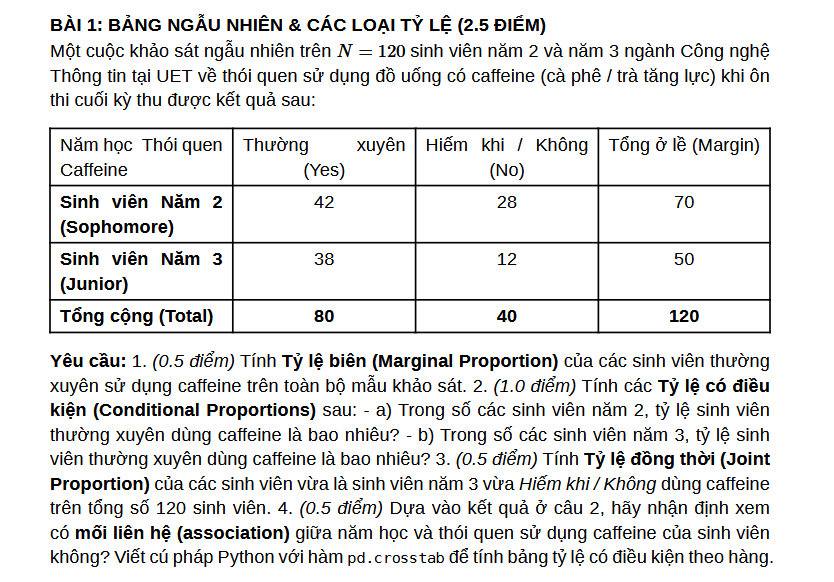
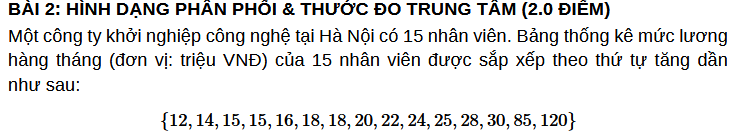
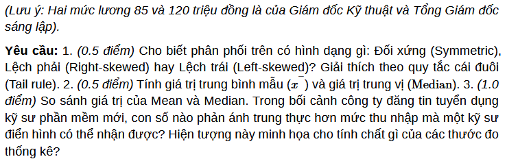
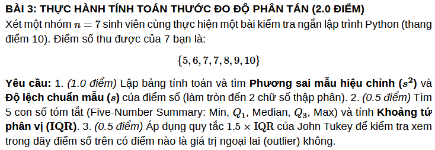
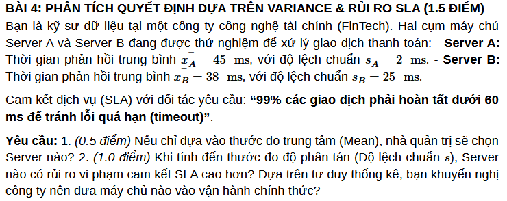
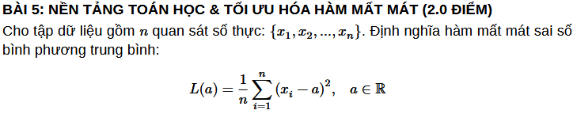
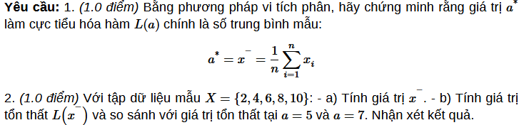
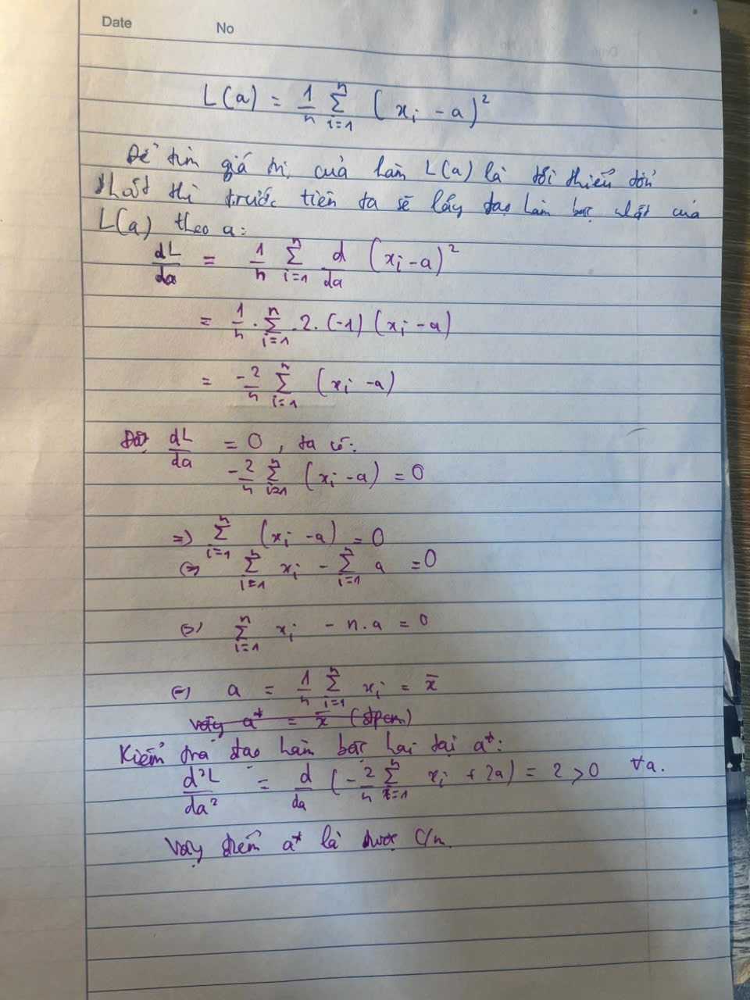

**Phiếu Bài Tập Về Nhà (Problem Set 02)**

**Môn học: Xác suất Thống kê (UET.MAT1052)**

**Chủ đề: Tóm Tắt Dữ Liệu & Nền Tảng Tối Ưu Hóa (Summarizing Categorical
&**

**Numerical Data)**

**Họ và tên sinh viên: Nguyễn Minh Đức**

**MSV: 25021352**

{width="6.5in" height="4.536111111111111in"}

**LỜI GIẢI BÀI 1**

**Yêu cầu 1**: Tính Tỷ lệ biên của sinh viên thường xuyên sử dụng
caffeine

\_ Tỷ lệ biên là tỷ lệ tính trên tổng toàn bộ mẫu khảo sát ($N = 120$),
chỉ xét riêng thói quen dùng caffeine mà không phân biệt năm học. Tổng
số sinh viên thường xuyên dung caffein theo bảng (không phân biệt năm
học) là 80 người.

- Như vậy, ta có công thức tính toán là:

> Tỉ lệ biên của sinh viên thường xuyên sử dụng caffein (P(Y)) = Tổng số
> sinh viên dung caffein/ tổng số sinh viên khảo sát = $\frac{80}{120}$
> \~ 0.6667 (66.67%)
>
> **Yêu cầu 2**: Tính các Tỷ lệ có điều kiện

a)  Trong số các sinh viên năm 2, tỷ lệ sinh viên thường xuyên dùng
    caffeine:

> \_ Không gian mẫu mới là 70 người (năm 2), số sinh viên năm 2 thường
> sử dụng caffein là 42 người
>
> $P(Y|S\_ 2\ ) = \frac{Số\ SV\ Năm\ 2\ dùng\ Caffeine}{Tổng\ số\ SV\ Năm\ 2}\$
> = $\frac{42}{70} = \frac{3}{5} = 0.6 = 60\%\ \$

b)  Trong số các sinh viên năm 3, tỷ lệ sinh viên thường xuyên dùng
    caffeine:

\_ Không gian mẫu mới là 50 người (năm 3), số sinh viên năm 3 thường sử
dụng caffein là 38 người

$$P\left( Y \middle| S_{2} \right) = \frac{Số\ SV\ Năm\ 3\ dùng\ Caffeine}{Tổng\ số\ SV\ Năm\ 3} = \frac{38}{50} = \frac{19}{25} = 0.76 = 76\%$$

**Yêu cầu 3**: Tính Tỷ lệ đồng thời

\_ Số sinh viên thỏa mãn vừa là năm 3 vừa Hiếm khi / Không dùng caffeine
(ô giao giữa dòng \"Năm 3\" và cột \"No\"): $12$ người.

$$P\left( Y \middle| S_{2} \right) = \frac{Số\ SV\ năm\ 3\ và\ không\ dùng\ caffein}{Tổng\ số\ SV\ khảo\ sát} = \frac{12}{120} = \frac{1}{10} = 0.1 = 10\%\ $$

**Yêu cầu 4**: Nhận định mối liên hệ giữa năm học và và tỉ lệ dung
caffein.

\_ Dựa vào kết quả ở Câu 2:

- Tỷ lệ thường xuyên dùng caffeine ở sinh viên Năm 2 là $60\%$.

- Tỷ lệ thường xuyên dùng caffeine ở sinh viên Năm 3 là $76\%$.

\_ Vì $P\left( Y \mid S_{2} \right) \neq P\left( Y \mid S_{3} \right)$
($60\% \neq 76\%$), tỷ lệ sử dụng caffeine thay đổi theo từng năm học
(sinh viên Năm 3 có xu hướng thường xuyên sử dụng caffeine cao hơn hẳn
so với sinh viên Năm 2 khi ôn thi).

$\Rightarrow$ Kết luận: Có mối liên hệ giữa năm học và thói quen sử dụng
caffeine của sinh viên.

Để tính bảng tỷ lệ có điều kiện theo hàng, ta truyền tham số
normalize=\'index\' vào hàm pd.crosstab:

+----------------------------------------------------------------------+
| import pandas as pd                                                  |
|                                                                      |
| conditional_table = pd.crosstab(                                     |
|                                                                      |
| df\[\"NamHoc\"\], df\[\"ThoiQuen\"\], normalize=\"index\"            |
|                                                                      |
| )                                                                    |
|                                                                      |
| print(conditional_table)                                             |
+======================================================================+

{width="6.5in" height="1.18125in"}

{width="6.5in" height="2.040277777777778in"}

**LỜI GIẢI BÀI 2**

**Yêu cầu 1.**

\_ Tập dữ liệu mức lương của công ty khởi nghiệp có hình dạng phân phối
lệch phải (Right-skewed hay Positively skewed). Theo quy tắc cái đuôi
(Tail rule), phần lớn các giá trị dữ liệu mức lương tập trung ở vùng giá
trị thấp, dao động từ 12 đến 30 triệu VNĐ. Tuy nhiên, đường cong phân
phối lại kéo dài một cái đuôi về phía bên phải hướng tới các giá trị cực
lớn (outliers) là 85 triệu VNĐ và 120 triệu VNĐ. Việc xuất hiện các giá
trị cực đoan nằm hẳn về phía bên phải bảng số liệu đã làm cho phân phối
bị kéo lệch hẳn về phía giá trị lớn.

**Yêu cầu 2.**

\_ Giá trị trung bình (mean) là:

$$Mean = \frac{12 + 14 + 15*2 + 16 + 18*2 + 20 + 22 + 24 + 25 + 28 + 30 + 85 + 120}{15} \cong 33.47\ triệu\ VNĐ$$

\_ Giá trị trung vị (median): Theo như đề bài thì tổng cộng là có 15 giá
trị, thì giá trị trung vị sẽ nằm ở khoảng $\frac{15 + 1}{2} = 8$. Do đó
mà median sẽ là 20 triệu VNĐ.

**Yêu cầu 3.**

\_ Có thể thấy là giá trị median nhỏ hơn hẳn giá trị mean. Trong bối
cảnh công ty đăng tin tuyển dụng kỹ sư phần mềm mới, con số phản ánh
trung thực hơn mức thu nhập mà một kỹ sư điển hình có thể nhận được
chính là giá trị trung vị (20 triệu VNĐ). Dữ liệu thực tế cho thấy có
tới 13 trên tổng số 15 nhân viên trong công ty (chiếm $86.67\%$) nhận
mức lương từ 30 triệu VNĐ trở xuống. Nếu công ty sử dụng con số trung
bình là 33.47 triệu VNĐ để quảng bá, điều này sẽ tạo ra kỳ vọng sai lệch
cho ứng viên, bởi mức lương này thực chất cao hơn thu nhập của đại đa số
nhân viên và chỉ bị kéo vồng lên do hai mức lương rất cao của cấp lãnh
đạo.

\_ Hiện tượng này đã minh họa rất rõ nét về tính không bền vững của giá
trị trung bình (mean), thứ có thể bị ảnh hưởng rất lớn bởi các giá trị
ngoại lai (outliers). Ngược lại thì giá trị trung vị lại có tính bền
vững rất mạnh, ít bị ảnh hưởng hơn bởi các giá trị ngoại lai. Do đó nó
luôn là lựa chọn phù hợp và trung thực hơn để mô tả điểm trung tâm của
các phân phối lệch.

{width="6.5in" height="2.2493055555555554in"}

**LỜI GIẢI BÀI 3**

**Yêu cầu 1.**

  -----------------------------------------------------------------------------------------------------------------
  **i**      **Điểm     **Độ lệch                                         **Bình phương độ lệch
             x~i~**     (x~i~​−**$\overline{\mathbf{x}}\mathbf{\ }$**)**   (x~i~−**$\overline{\mathbf{x}}$**)^2^**
  ---------- ---------- ------------------------------------------------- -----------------------------------------
  1          5          $$5 - 7.43 = - 2.43$$                             $$5.90$$

  2          6          $$6 - 7.43 = - 1.43$$                             $$2.04$$

  3          7          $$7 - 7.43 = - 0.43$$                             $$0.18$$

  4          7          $$7 - 7.43 = - 0.43$$                             $$0.18$$

  5          8          $$8 - 7.43 = 0.57$$                               $$0.32$$

  6          9          $$9 - 7.43 = 1.57$$                               $$2.46$$

  7          10         $$10 - 7.43 = 2.57$$                              $$6.60$$

  **Tổng**   **52**     **0.00**                                          **17.68**
  -----------------------------------------------------------------------------------------------------------------

\_ Phương sai mẫu hiệu chỉnh ($s^{2}$):

${\ \ \ \ \ \ \ \ \ \ \ \ \ \ \ \ \ \ \ \ \ \ \ \ \ \ \ \ \ \ \ \ \ \ \ \ \ \ \ \ \ \ \ \ \ \ \ \ \ \ \ s}^{2} = \frac{\sum_{}^{}\left( x_{i} - \overline{x} \right)^{2}}{n - 1} = \frac{17.7143}{6} \approx 2.95$

**\_** Độ lệch chuẩn mẫu ($s$):

$$s = \sqrt{s^{2}} = \sqrt{2.9524} = 1.72$$

**Yêu cầu 2.**

**\_** Min = 5 ; Q~1~ = 6 ; Median = 7 ; Q~3~ = 9 ; Max = 10.

\_ Khoảng tứ phân vị là (IQR) là:

$$\text{IQR} = Q_{3} - Q_{1} = 9 - 6 = 3$$

**Yêu cầu 3.**

\_ $1.5 \times \text{IQR} = 1.5 \times 3 = 4.5\$

\_ Ranh giới dưới:

$$\text{Lower~Bound} = Q_{1} - 1.5 \times \text{IQR} = 6 - 4.5 = 1.5$$

\_ Ranh giới trên:

$$\text{Upper~Bound} = Q_{3} + 1.5 \times \text{IQR} = 9 + 4.5 = 13.5$$

Xét trong khoảng \[1.5, 13.5\] ta thấy các giá trị trong dãy đều nằm
trong khoảng này nên mẫu này có thể nhận xét là không có giá trị ngoại
lai nào.

{width="6.5in" height="2.5819444444444444in"}

**Yêu cầu 1.**

**\_** Nếu chỉ dựa vào thước đo trung tâm thì rõ rang là server B sẽ
được chọn vì mean của nó nhỏ hơn mean của server A (38 \< 45).

**Yêu cầu 2.**

\_ Khi tính đến độ lệch chuẩn $s$, server B có rủi ro vi phạm cam kết
SLA cao hơn rất nhiều so với server A. Dù có thời gian trung bình tốt
hơn (${\overline{x}}_{B} = 38\text{~ms}$), độ lệch chuẩn của Server B
lại cực lớn ($s_{B} = 25\text{~ms}$), khiến biến động thời gian phản hồi
ở mức $1\sigma$ (\[13 ms, 63 ms\]) đã vượt ngưỡng SLA quy định
$60\text{~ms}$. Trong khi đó, Server A có độ lệch chuẩn rất nhỏ
($s_{A} = 2\text{~ms}$), giúp $gần\ như\ 100\%$ giao dịch đều nằm an
toàn trong khoảng \[39 ms, 51 ms\], đảm bảo không bị vượt ngưỡng
$60\text{~ms}$. Do đó, tôi khuyến nghị công ty chọn server A đưa vào vận
hành chính thức. Trong môi trường FinTech, sự ổn định và kiểm soát rủi
ro (độ lệch chuẩn thấp) luôn quan trọng hơn ưu thế nhỏ về tốc độ trung
bình nhưng lại thất thường và hay gây lỗi quá hạn.

{width="6.5in" height="1.2840277777777778in"}

{width="6.5in" height="1.573611111111111in"}

**Yêu cầu 1.**

{width="4.507812773403325in"
height="6.010416666666667in"}

**Yêu cầu 2.**

a\) Tính giá trị trung bình mẫu $\overline{x}$

$$\overline{x} = \frac{\sum_{i = 1}^{5}x_{i}}{n} = \frac{2 + 4 + 6 + 8 + 10}{5} = \frac{30}{5} = 6$$

b\) Tính giá trị tổn thất $L\left( \overline{x} \right)$ và so sánh với
$L(5)$, $L(7)$

$$L\left( \overline{x} \right) = L(6) = 8$$

$$L(5) = 9$$

$$L(7) = 9$$

Ta thấy : $L(6) = 8 < L(5) = 9$ ; $L(6) = 8 < L(7) = 9$

Kết quả thực nghiệm này minh chứng cho tính chất lý thuyết: Giá trị
trung bình mẫu $\overline{x}$ chính là điểm tối ưu duy nhất làm tối
thiểu hóa hàm tổn thất bình phương trung bình $L(a)$.
